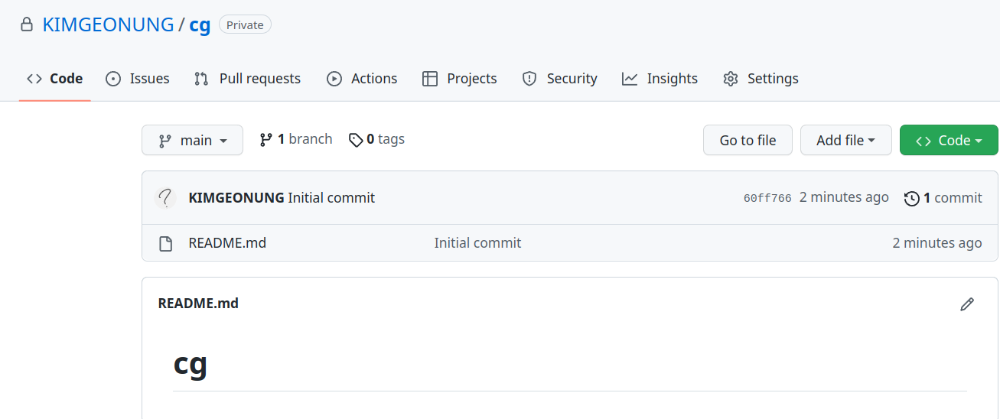
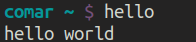
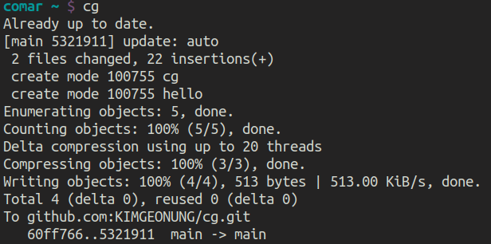

_Written by Geonung Kim_

## Motivation

To maintain and resue custom scripts usually fail becuase of following reasons.
- We forget where the script is
- We forget how the scripts are used
- We are lazy and busy

In this workshop, we will build a cycle to maintain and reuse custom scripts.
After learning, we have to be able to  permanently develop and store our custom scripts.

## Requirements

- github account
- _apt install git_
- Linux based operating system

## Main Toturial
Let's start step by step.

### Let's make nickname

In ths tutorial, I'm going to use _"cg_". I recommand a short nickname as we gonna use this one as bash command.

### Create a github repository named with nickname for your custom scripts 

In ths tutorial, I'm going to use 

<figure>

<figcaption align = "center"><b></b></figcaption>
</figure>

### Set PATH environment variable

```sh
# Define to .bashrc file
export PATH="$HOME/cg:$PATH"
alias cdcg='cd $HOME/cg'
```

### Clone the repository to where you define 

The location should be the path defined a step before.

```sh
git clone https://github.com/KIMGEONUNG/cg
```

### Let's make a toy script

```sh
# Go to the directory of the reopsotiory
cdcg

# Make a program which print "hello world"
echo "echo hello world" > hello

# Make a program executable
chmod 755 hello

# Change current directory to HOME
cd ~

# Execute the command
hello
```

Finally, you can see the results in our bash.

<figure>

<figcaption align = "center"><b>Printed results</b></figcaption>
</figure>

### The scripts do not need to be shell script with SHEBANG(#!)

Make the script with file name _hellopy_ and executable.
```python
#!/usr/bin/env python
print('hello python')
```


### Let's make a script for syncronization 

```sh
# Go to the directory of the reopsotiory
cdcg
```

The syncronization script is as follow

```sh
#!/bin/bash

name='cg'

# Change directory saving current directory without Stdout
pushd "$HOME/$name" > /dev/null

# Pull from remote
git pull

# Add all changes
git add .

# Commit
git commit -m "update: auto"

# Push
git push

# Restore working directory
popd > /dev/null
```


Don't forget to change the script as executable
```sh
chmod 755 cg
```

Let's start sync. command.
```sh
cd ~
cg
```

The results is as follow

<figure>

<figcaption align = "center"><b></b></figcaption>
</figure>

### Let's make some scripts

#### git clog

```sh
#!/bin/bash

git log --oneline --all --graph
```

#### 2mark

```sh
#!/bin/bash

if [[ -z $1 ]]; then
    echo Error: Specify mark number for access 
    exit 1
fi

if [[ $1 == 9 || $1 == 10 ]]; then
    ssh -o ServerAliveInterval=15 \
        -t k2woong92@mark8.postech.ac.kr ssh \
            -i /home/k2woong92/.ssh/mark k2woong92@mark${1}.postech.ac.kr
elif [[ $1 == 12 ]]; then
    ssh -o ServerAliveInterval=15 \
        -t k2woong92@mark11.postech.ac.kr ssh \
            -i /home/k2woong92/.ssh/mark k2woong92@mark${1}.postech.ac.kr
else
    ssh -o ServerAliveInterval=15 \
        k2woong92@mark${1}.postech.ac.kr
fi
```

#### im-noise
```python
#!/usr/bin/env python

import sys
from PIL import Image
from skimage.io import imread
import numpy as np


def parse():
    import argparse
    parser = argparse.ArgumentParser(description='Add noise')
    parser.add_argument('-r',
                        '--replace',
                        default=False,
                        action='store_true',
                        help='replace input')
    parser.add_argument('-m', '--mean', type=float, default=0.0, help='mean')
    parser.add_argument('-v',
                        '--var',
                        type=float,
                        default=0.1,
                        help='variance')
    return parser.parse_args()


def add_noise(x, mean, var):
    x = x / 255.0
    noise = np.random.normal(mean, var, x.shape)
    x = x + noise
    x = x.clip(0, 1)
    x = (x * 255).astype('uint8')
    return x


def main():
    args = parse()

    target_files = sys.stdin.read().splitlines()
    print("target files: %d EA" % len(target_files), file=sys.stderr)

    for target_file in target_files:
        x = imread(target_file)
        x_noise = add_noise(x, mean=args.mean, var=args.var)
        im = Image.fromarray(x_noise)

        path_output = None
        if args.replace:
            path_output = target_file
        else:
            parts = target_file.split('.')
            head = ''.join(parts[:-1])
            ext = parts[-1]
            path_output = head + '_noise%.1f' % (args.var) + "." + ext

        im.save(path_output, quality=100, subsampling=0)
        print(path_output)


if __name__ == '__main__':
    main()
```
