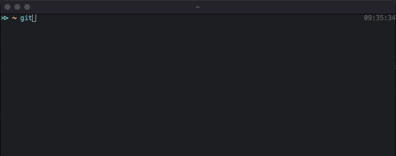

# ZSH and OH-MY-ZSH

## Shell

---

운영 체제 상에서 다양한 운영 체제 기능과 서비스를 구현하는 인터페이스를제공하는 프로그램

- Sh

  - Bourne shell
  - 쉘의 한 종류로 초기의 유닉스 쉘로 태어났다는 의미에서 Bourne shell (sh)로 불림

- Bash

  - Ubuntu default shell

- Z shell

  - Bash의 일부 기능을 포함하며 추가적인 기능들을 포함하는 확장된 쉘
  - 다양한 테마로 shell을 꾸밀 수 있으며, 사용하기 편리한 다수의 기능들이 제공 됨

## Installation

---

- Install zsh

  - In Ubuntu

    ```
    # zsh 설치
    sudo apt-get install zsh

    # 설치경로 확인
    which zsh
    # => /usr/bin/zsh

    # 기본 sh 변경
    chsh -s $(which zsh)
    ```

  - In Mac os

    ```
    # zsh 설치
    brew install zsh

    # 설치경로 확인
    which zsh
    #=> /usr/bin/zsh

    # 기본 sh 변경
    chsh -s $(which zsh)
    ```

  - 설치 완료 후 

- Install oh-my-zsh

  - zsh 설정 관리를 위한 프레임워크로 수많은 플러그인과 테마를 지원

  - In Ubuntu

    ```
    # git wget curl 설치 확인
    # sudo apt install wget curl git

    # oh-my-zsh 설치
    sh -c "$(curl -fsSL https://raw.githubusercontent.com/robbyrussell/oh-my-zsh/master/tools/install.sh)"
    ```

  - In Mac os

    ```
    # git wget curl 설치 확인

    # oh-my-zsh 설치
    sh -c "$(curl -fsSL https://raw.githubusercontent.com/robbyrussell/oh-my-zsh/master/tools/install.sh)"
    ```

## Edit .zshrc file

---

- In current directory
  - .zshrc_original - 초기 .zshrc
  - .zshrc - example .zshrc
  - .zshrc_kkang - kkang .zshrc

## Why zsh

---

- Directory 자동추천
- 재귀 경로 확장 : 예를 들어 “/ u / lo / b”는 “/ usr / local / bin”으로 확장
- 철자 교정 및 대략적인 완성 : 디렉토리 이름을 입력하는 데 약간의 실수가 있으면 ZSH가 이를 수정
- 플러그인 및 테마 지원

- However..., it is slow sometimes... In this case, we need to set .zshrc (알아서 잘..., 주로 Git 관련)

## Plugins

---

- git
- zsh-autosuggestions
- zsh-syntax-highlighting
- autojump
  ```
  <!-- Install autojump -->
  sudo apt update
  sudo apt install autojump
  ```

## vs Fish shell

---
- Pros
  - auto completion
  
    
  
  - 테마 설정이 훨씬 편리함
- Cons

  - Small community
  - Non-POSIX compatible

    ```
    export ANDROID_HOME=$HOME/Library/Android/sdk
    export PATH=$PATH:$ANDROID_HOME/platform-tools

    vs

    set -gx ANDROID_HOME $HOME/Library/Android/sdk
    set -gx PATH $ANDROID_HOME/platform-tools $PATH
    ```
